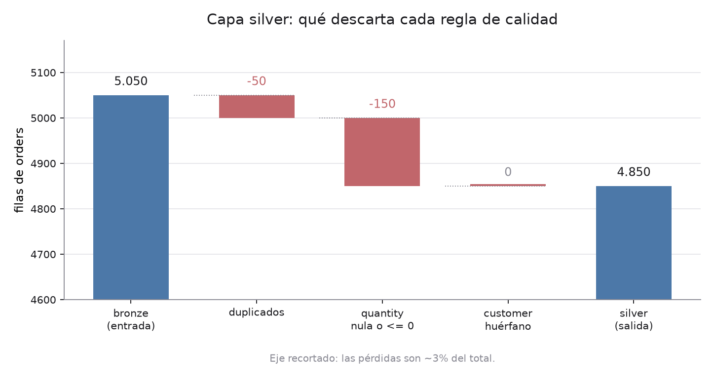
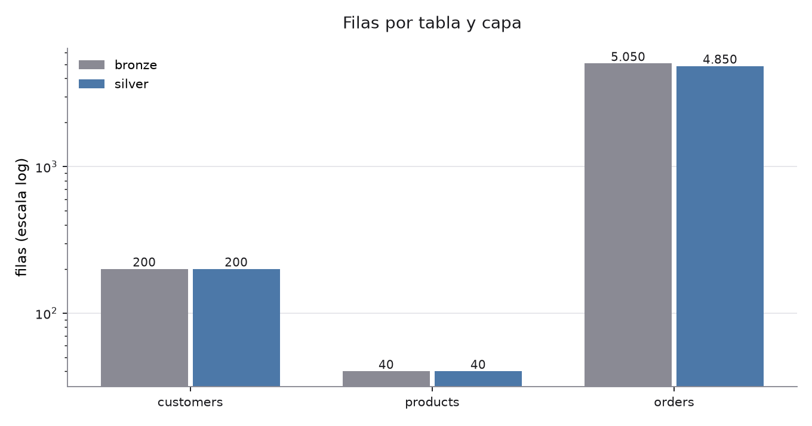
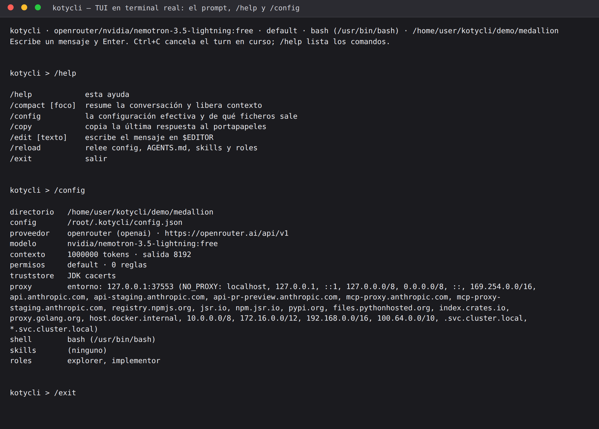
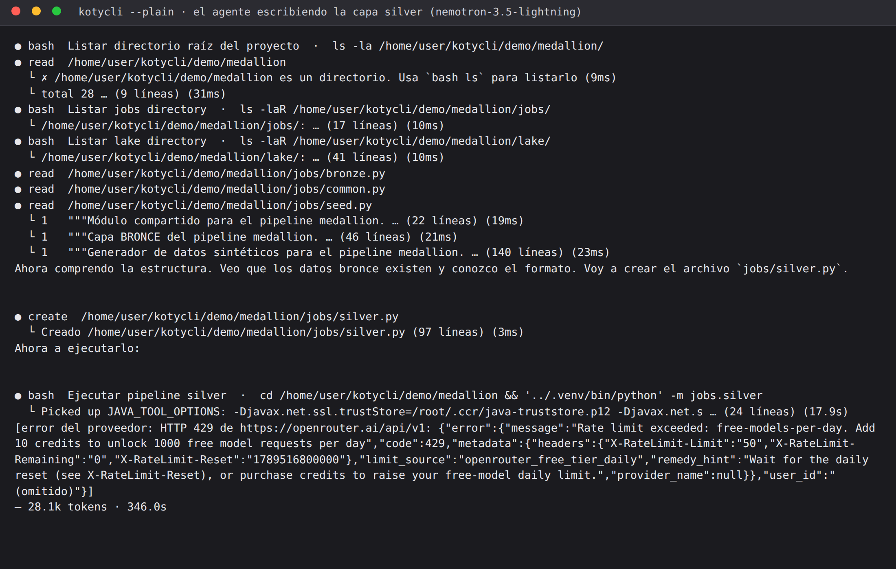

# demo — kotycli contra un modelo real

Prueba de kotycli con un proveedor de verdad (OpenRouter, `nvidia/nemotron-3.5-lightning:free`)
encargándole un proyecto de ETL con arquitectura medallion en PySpark local.

Doble objetivo: **tener el proyecto** y, sobre todo, **ver qué se rompe en kotycli** cuando lo maneja
un modelo real en un terminal real. Se rompieron dos cosas; las dos están arregladas y con test.

## El token

La config guarda **el nombre de la variable de entorno**, nunca su valor:

```json
"apiKeyEnv": "OPENROUTER_TOKEN"
```

Vive en **`~/.kotycli/config.json`**, que es donde va: el proveedor, el modelo y la clave son del
usuario, no del repositorio. `Config.load` lee primero `~/.kotycli/` y encima superpone
`<proyecto>/.kotycli/` si existe, para lo que de verdad sea del proyecto. Para reproducir la demo:

```json
{
  "provider": "openrouter",
  "providers": {
    "openrouter": {
      "type": "openai",
      "baseUrl": "https://openrouter.ai/api/v1",
      "model": "nvidia/nemotron-3.5-lightning:free",
      "apiKeyEnv": "OPENROUTER_TOKEN",
      "contextWindow": 1000000,
      "maxOutputTokens": 8192
    }
  }
}
```

El token se lee de `$OPENROUTER_TOKEN` en tiempo de ejecución. No está en ningún fichero de este
repositorio, ni en los logs, ni en los pantallazos: se comprobó con `grep -rF "$OPENROUTER_TOKEN"`
sobre `demo/` entero antes de cada commit. Del mensaje de error de OpenRouter se ha omitido además
el `user_id` de la cuenta, que no es secreto pero tampoco pinta nada aquí.

## Qué hay y quién lo ha escrito

| Ruta | Quién | Qué |
|---|---|---|
| `medallion/jobs/seed.py` | **el agente** | Genera los CSV de partida con suciedad realista |
| `medallion/jobs/common.py` | **el agente** | `get_spark(app_name)` |
| `medallion/jobs/bronze.py` | **el agente** | CSV → Parquet sin castear, con `_ingested_at` y `_source_file` |
| `medallion/jobs/silver.py` | **el agente** | Casteo, deduplicado, reglas de calidad e informe JSON |
| `medallion/jobs/gold.py` | — | **Sin hacer**: se agotó la cuota diaria (ver más abajo) |
| `medallion/AGENTS.md` | yo | Las reglas del proyecto que lee el agente |
| `tools/shot.py`, `tools/charts.py` | yo | Utillaje de documentación, no parte del pipeline |
| `run-agent.sh` | yo | Lanza kotycli y guarda la transcripción |

## Cómo se ejecuta

```bash
python3 -m venv .venv && .venv/bin/pip install pyspark==3.5.3 matplotlib pandas
cd medallion
../.venv/bin/python -m jobs.seed     # landing/*.csv
../.venv/bin/python -m jobs.bronze   # lake/bronze/
../.venv/bin/python -m jobs.silver   # lake/silver/ + _quality_report.json
```

El venv hace falta: el `setuptools` parcheado de Debian que trae el sistema revienta al construir
pyspark con `AttributeError: install_layout`.

## El pipeline

```
landing/*.csv  ──bronze──▶  lake/bronze/   ──silver──▶  lake/silver/
 (texto sucio)              (Parquet,                    (Parquet, tipado,
                             todo string,                 deduplicado, limpio,
                             + trazabilidad)              + informe de calidad)
```

Suciedad que mete `seed.py` a propósito en `orders.csv` (5050 filas):
151 con `quantity` vacía o negativa, 101 con `customer_id` inexistente, 50 duplicados exactos.

Informe que deja `silver.py` en `lake/silver/_quality_report.json`:

```json
{"orders_in": 5050, "duplicates_removed": 50, "bad_quantity_removed": 150,
 "orphan_customer_removed": 0, "orders_out": 4850}
```





**Ojo con ese `orphan_customer_removed: 0`**: no es un fallo de `silver.py`. El generador puso los
`customer_id` huérfanos en las mismas filas que las `quantity` malas, así que cuando le toca el turno
al `left_semi` ya no queda ninguno. Es un defecto del generador —la suciedad debería repartirse—, y se
ve solo porque el informe cuenta paso a paso en vez de dar un total. Verificado a mano: tras silver no
quedan huérfanos, ni duplicados, ni cantidades malas.

## Los dos fallos de kotycli que salieron

### 1. La TUI se comía los acentos si el locale no es UTF-8

Es la primera vez que la TUI se ejecutaba fuera de un test. Con `script` (que da un PTY de verdad)
apareció enseguida: `conversaci?n`, y el `·` del banner como `?`.

Causa: sin `LANG` UTF-8 la JVM deduce `stdout.encoding = ANSI_X3.4-1968`. `Main.ensureUtf8Stdout()`
arregla `--plain` y `--acp`, que escriben por `System.out`, pero **la TUI escribe por el writer de
JLine**, y desde JLine 3.25 ese writer usa `stdoutEncoding`, un ajuste distinto de `encoding` (ese es
el charset interno del terminal, no el del writer).

Arreglado en `Tui.terminalBuilder()`, con test en `TerminalEncodingTest`.



### 2. Un turn que acaba sin respuesta no decía nada

En una corrida, el modelo llamó a dos tools y cerró el turn sin escribir una palabra. kotycli pintaba
las dos líneas de tool y el separador de tokens, y nada más: parecía que se había colgado.

`AgentEvent.TurnEnd` lleva ahora `answered`, y la TUI y `--plain` avisan con
`[el modelo ha terminado sin contestar nada]`. Test en `RunLoopTest`.

## Lo que se aprendió del modelo y del proveedor



- **Se autocorrige.** En `seed.py` pidió ~50 filas duplicadas, comprobó que salían 0, dedujo que era
  porque les reasignaba `order_id`, y lo arregló solo. Tres iteraciones.
- **Es lento y caro en tokens**: bronze le costó 128k tokens y 10 minutos; silver 28k y 6.
- **Se despista con `read` sobre un directorio** en casi cada arranque. El mensaje de error de kotycli
  («es un directorio, usa `bash ls`») le basta para corregir, pero se repite tanto que quizá merezca
  que `read` liste el directorio en vez de fallar.
- **A veces no contesta** (el fallo 2 de arriba). Con encargos largos pasa más: la segunda versión del
  encargo de silver, más corta y numerada, sí funcionó.
- **Ignora parte del `AGENTS.md`**: usó `python3` del sistema para comprobaciones sueltas pese a que el
  fichero dice explícitamente que nunca lo haga (daba igual, eran scripts de la librería estándar).
- Dejó un typo inocuo en `bronze.py`: `LAKING_DIR` por `LANDING_DIR`. Se deja tal cual: el código es suyo.

## Por qué falta la capa gold

El tier gratuito de OpenRouter da **50 peticiones al día** y una sola tanda del agente gasta entre 10
y 20. Se agotaron a mitad del encargo de silver:

```
HTTP 429: Rate limit exceeded: free-models-per-day
X-RateLimit-Limit: 50 · X-RateLimit-Remaining: 0
```

Se repone a las 00:00 UTC del día siguiente. `silver.py` ya se había escrito y ejecutado cuando saltó;
lo único que se perdió fue el mensaje final del agente.

Queda sin hacer `jobs/gold.py` (agregados de negocio: ventas por país, por categoría y por mes, y las
gráficas correspondientes). Las gráficas de este README salen de `tools/charts.py`, que escribí yo para
documentar la corrida; no son la capa gold.

## Logs

Transcripciones completas en `logs/`, una por tanda:

| Fichero | Encargo | Resultado |
|---|---|---|
| `01-seed.log` | Generador de datos | Cortado por mi timeout de 900 s mientras iteraba |
| `01b-seed-dups.log` | Arreglar los duplicados | OK, 42k tokens, 166 s |
| `02-bronze.log` | Capa bronze | OK, 128k tokens, 607 s |
| `03-silver.log` | Capa silver (1er intento) | El modelo no contestó: 5.9k tokens, 69 s |
| `03b-silver.log` | Capa silver (2º intento) | OK, pero acabó en 429 |
| `tui-help-config.ansi` | Captura ANSI de la TUI | Origen del pantallazo 01 |

Las capturas ANSI se tomaron alimentando el PTY por tubería, así que el eco de lo tecleado aparece
donde no lo pondría una persona escribiendo en vivo.
