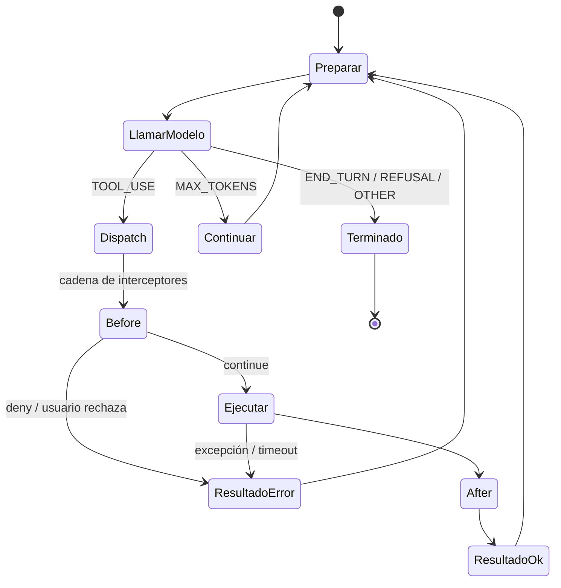

# 02. El agent loop

El loop es el corazón del harness. Todo lo demás (tools, skills, subagentes, proveedores, frontends) se enchufa aquí. Tiene que ser pequeño, legible y sin conocimiento de ningún proveedor ni de ninguna UI. Un solo `runLoop`, reutilizado recursivamente por los subagentes.

## Modelo de mensajes neutral

```kotlin
enum class Role { USER, ASSISTANT }

data class Message(val role: Role, val content: List<Block>)

sealed interface Block {
    data class Text(val text: String) : Block
    data class ToolUse(val id: String, val name: String, val input: JsonObject) : Block
    data class ToolResult(val toolUseId: String, val content: String, val isError: Boolean = false) : Block
    /** Bloque que solo entiende el proveedor que lo generó (reasoning, compaction, etc.).
     *  Se reenvía intacto al mismo proveedor y se descarta si cambia el proveedor. */
    data class Opaque(val providerId: String, val payload: JsonElement) : Block
}

enum class StopReason { END_TURN, TOOL_USE, MAX_TOKENS, REFUSAL, OTHER }

data class Completion(val message: Message, val stopReason: StopReason, val usage: Usage)
```

Reglas:

- Los `ToolResult` de una misma ronda van **todos en un único mensaje `USER`**. Cómo se serializa eso en cada wire (bloques en un mensaje, o N mensajes `role: tool` en el wire OpenAI) es cosa del adaptador.
- `Opaque` existe para no perder bloques de proveedor sin que el core sepa qué son.
- `input` de `ToolUse` se parsea siempre como JSON. Nunca se hace matching sobre la cadena serializada.

## AgentContext

```kotlin
class AgentContext(
    val id: String,
    val depth: Int,                       // 0 = raíz
    val config: AgentConfig,              // system prompt, modelo, modo de permisos
    val provider: Provider,
    val tools: ToolRegistry,
    val interceptors: List<ToolInterceptor>,
    val budget: Budget,                   // compartido con el padre en el caso de subagentes
    val contextManager: ContextManager,
    val events: MutableSharedFlow<AgentEvent>,
) {
    val messages: MutableList<Message>
}
```

Un subagente es otro `AgentContext` con `messages` vacío, `depth + 1`, un `ToolRegistry` restringido y el **mismo** `Budget` que el padre, de modo que los tokens que quema se descuentan del total de la sesión.

## El loop

```kotlin
suspend fun runLoop(ctx: AgentContext, userInput: String) {
    ctx.messages += Message(USER, listOf(Text(userInput)))
    var iterations = 0

    while (true) {
        if (++iterations > ctx.config.maxIterationsPerTurn) { ctx.events.emit(BudgetExceeded("iterations")); return }
        ctx.contextManager.prepare(ctx)                    // truncado / compactación si toca

        val completion = ctx.provider.stream(ctx.request()).collectToCompletion { delta -> ctx.events.emit(delta) }
        ctx.messages += completion.message
        ctx.budget.consume(completion.usage)
        ctx.events.emit(AssistantMessage(ctx.id, completion.message))

        when (completion.stopReason) {
            END_TURN   -> return
            MAX_TOKENS -> { ctx.messages += Message(USER, listOf(Text("Continúa donde lo dejaste."))); continue }
            REFUSAL    -> { ctx.events.emit(Refusal(ctx.id)); return }
            OTHER      -> return
            TOOL_USE   -> {
                val calls = completion.message.content.filterIsInstance<ToolUse>()
                ctx.messages += Message(USER, dispatch(ctx, calls))
            }
        }
    }
}
```

Diagrama de estados:



## Dispatch de tools e interceptores

```kotlin
interface ToolInterceptor {
    /** Antes de ejecutar. Devuelve null para continuar o un ToolResult para cortocircuitar (p.ej. denegado). */
    suspend fun before(ctx: AgentContext, tool: Tool, call: ToolUse): ToolResult? = null
    /** Después de ejecutar. Puede transformar el resultado (truncar, redactar, anotar). */
    suspend fun after(ctx: AgentContext, tool: Tool, call: ToolUse, result: ToolResult): ToolResult = result
}
```

Interceptores previstos, en orden:

| Interceptor | before | after |
|-------------|--------|-------|
| `PathGuard` | Canonicaliza rutas del input contra el working dir; deniega las que se salen | |
| `Permissions` | `Allow` / `Ask` / `Deny` según modo y reglas; `Ask` emite `PermissionAsk` y espera la respuesta del frontend | |
| `ToolLog` | Escribe la llamada a `~/.agents/logs/tools.jsonl` | Escribe resultado, duración y `isError` |
| `Truncate` | | Corta el resultado a ~30-50 KB conservando cabeza y cola, avisando en el propio texto |

Esto es todo el "sistema de hooks". Un punto de corte before/after cubre permisos, logging y guardas. No hay hooks configurables por fichero: para un usuario, el código es la config (ver ADR 0009).

```kotlin
suspend fun dispatch(ctx: AgentContext, calls: List<ToolUse>): List<ToolResult> = coroutineScope {
    val (readOnly, mutating) = calls.partition { ctx.tools[it.name]?.readOnly == true }
    val parallel = readOnly.map { async { runOne(ctx, it) } }
    val serial = mutating.map { runOne(ctx, it) }              // en orden, uno a uno
    (parallel.awaitAll() + serial).sortedBy { r -> calls.indexOfFirst { it.id == r.toolUseId } }
}

private suspend fun runOne(ctx: AgentContext, call: ToolUse): ToolResult {
    val tool = ctx.tools[call.name] ?: return ToolResult(call.id, "Tool desconocida: ${call.name}", isError = true)
    for (i in ctx.interceptors) i.before(ctx, tool, call)?.let { return it }
    ctx.events.emit(ToolStart(ctx.id, call))
    var result = runCatching { withTimeout(tool.timeout) { tool.execute(call.input, ToolContext(ctx)) } }
        .getOrElse { ToolResult(call.id, "Error: ${it.message}", isError = true) }
    for (i in ctx.interceptors.asReversed()) result = i.after(ctx, tool, call, result)
    ctx.events.emit(ToolEnd(ctx.id, result))
    return result
}
```

Reglas:

- Una tool que falla devuelve `ToolResult(isError = true)`. **Nunca** se omite el resultado ni se lanza fuera del dispatcher: el modelo necesita ver el error para corregir. Nada tumba el loop.
- Tools `readOnly` (`read`, `fetch`) se ejecutan en paralelo. Las demás en serie y en el orden que las pidió el modelo.
- El orden de los resultados en el mensaje final sigue el orden de las llamadas.

## Gestión de contexto

`ContextManager.prepare(ctx)` corre antes de cada llamada al modelo. Tres niveles, del más barato al más caro:

1. **Truncado de resultados en el interceptor `Truncate`.** No es gestión de contexto, es higiene, pero evita el 80% de los problemas.
2. **Poda de resultados viejos.** Cuando el historial supera un umbral, los `ToolResult` más antiguos que N rondas se sustituyen por un marcador `[resultado descartado, vuelve a ejecutar la tool si lo necesitas]`. Solo si `Capabilities.allowsHistoryEdits`; si no, saltamos al nivel 3.
3. **Compactación** (`/compact` o automática cerca del límite). Se pide un resumen al modelo y el historial pasa a ser `[resumen] + [últimas K rondas]`. Se emite `Compacted` para que el frontend lo muestre.

Estimación de tokens: el `usage` de la última respuesta como medida real. Antes de la primera respuesta, caracteres/4.

## Cancelación

- Cada `runLoop` corre dentro de un `Job`. Ctrl+C (o `session/cancel` en ACP) cancela el `Job`.
- `Provider.stream` es cancelable: el adaptador cierra la conexión HTTP.
- `bash` destruye el árbol de procesos (`ProcessHandle.descendants()`).
- Los subagentes son hijos del `Job` del padre: cancelación en cascada gratis.
- Tras una cancelación a mitad de ronda, se cierra la ronda añadiendo un `ToolResult(isError = true, "cancelado")` por cada llamada pendiente. Nunca se borra el `ToolUse`.

## Eventos hacia el frontend

El loop no imprime nada. Emite `AgentEvent` en un `SharedFlow` etiquetado por agente, y cada frontend (TUI, `--plain`, ACP) decide cómo pintarlo:

```kotlin
sealed interface AgentEvent {
    val agentId: String
    data class TextDelta(override val agentId: String, val text: String) : AgentEvent
    data class AssistantMessage(override val agentId: String, val message: Message) : AgentEvent
    data class ToolStart(override val agentId: String, val call: ToolUse) : AgentEvent
    data class ToolEnd(override val agentId: String, val result: ToolResult, val durationMs: Long) : AgentEvent
    data class PermissionAsk(override val agentId: String, val tool: Tool, val input: JsonObject, val reply: CompletableDeferred<PermissionReply>) : AgentEvent
    data class SubagentStart(override val agentId: String, val parentId: String, val agentType: String, val prompt: String) : AgentEvent
    data class SubagentEnd(override val agentId: String, val tokensBurned: Int, val tokensReturned: Int) : AgentEvent
    data class Compacted(override val agentId: String, val before: Int, val after: Int) : AgentEvent
    data class UsageUpdate(override val agentId: String, val usage: Usage) : AgentEvent
    data class BudgetExceeded(override val agentId: String, val what: String) : AgentEvent
    data class Refusal(override val agentId: String) : AgentEvent
}
```

`PermissionAsk` lleva un `CompletableDeferred`: el frontend lo completa cuando el usuario responde. En `--plain` sin TTY o sin frontend suscrito, se completa con `Deny` tras el timeout.

## Presupuestos

| Límite | Dónde | Por defecto |
|--------|-------|-------------|
| Iteraciones por turn | `AgentConfig.maxIterationsPerTurn` | 50 (raíz), 30 (subagente) |
| Tokens totales por sesión | `Budget.maxTokens` | sin límite, configurable; los subagentes descuentan del mismo |
| Timeout por tool | `Tool.timeout` | 2 min (bash), 30 s (fetch), 10 s (resto) |
| Profundidad de subagentes | `AgentConfig.maxDepth` | 2 |
| Subagentes concurrentes | `AgentConfig.maxConcurrentSubagents` | 4 |

Superar un presupuesto termina el turn con un evento `BudgetExceeded`, nunca con una excepción sin capturar.
