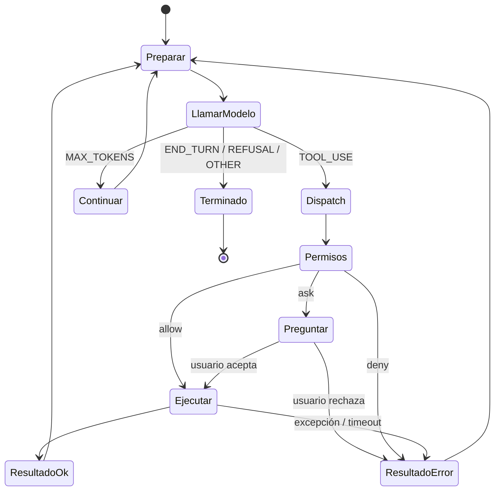

# 02. El agent loop

El loop es el corazón del harness. Todo lo demás (tools, skills, subagentes, proveedores) se enchufa aquí. Tiene que ser pequeño, legible y sin conocimiento de ningún proveedor.

## Modelo de mensajes neutral

```kotlin
enum class Role { USER, ASSISTANT }

data class Message(val role: Role, val content: List<Block>)

sealed interface Block {
    data class Text(val text: String) : Block
    data class ToolUse(val id: String, val name: String, val input: JsonObject) : Block
    data class ToolResult(val toolUseId: String, val content: String, val isError: Boolean = false) : Block
    /** Bloque que solo entiende el proveedor que lo generó (thinking, compaction, etc.).
     *  Se reenvía intacto al mismo proveedor y se descarta si cambia el proveedor. */
    data class Opaque(val providerId: String, val payload: JsonElement) : Block
}

enum class StopReason { END_TURN, TOOL_USE, MAX_TOKENS, REFUSAL, OTHER }

data class Completion(
    val message: Message,          // role = ASSISTANT
    val stopReason: StopReason,
    val usage: Usage,
)
```

Reglas:

- Los `ToolResult` de una misma ronda van **todos en un único mensaje `USER`**. Repartirlos en varios mensajes enseña al modelo a dejar de hacer llamadas paralelas.
- `Opaque` existe para no perder bloques de proveedor (thinking, compaction) sin que el core sepa qué son. Se reenvían tal cual al mismo `providerId` y se filtran si el proveedor cambia.
- `input` de `ToolUse` se parsea siempre como JSON. Nunca se hace matching sobre la cadena serializada.

## Session

```kotlin
class Session(
    val id: String,
    val config: SessionConfig,           // system prompt, modelo, presupuesto, modo de permisos
    val provider: LlmProvider,
    val tools: ToolRegistry,
    val permissions: PermissionPolicy,
    val context: ContextManager,
    val events: MutableSharedFlow<AgentEvent>,   // lo que ve la UI
) {
    val history: MutableList<Message>
}
```

Una `Session` es una conversación. Un subagente es otra `Session` con su propio `history`, un `ToolRegistry` restringido y el mismo `provider` (o uno más barato).

## El loop

```kotlin
suspend fun AgentLoop.runTurn(session: Session, userInput: String) {
    session.history += Message(USER, listOf(Text(userInput)))
    var iterations = 0

    while (true) {
        if (++iterations > session.config.maxIterationsPerTurn) throw BudgetExceeded("iterations")
        session.context.prepare(session)               // truncado / compactación si toca

        val completion = session.provider.complete(
            Request(system = session.systemPrompt(), messages = session.history,
                    tools = session.tools.definitions(), model = session.config.model)
        )
        session.history += completion.message
        session.events.emit(AgentEvent.AssistantMessage(completion.message))

        when (completion.stopReason) {
            END_TURN   -> return
            MAX_TOKENS -> { session.history += Message(USER, listOf(Text("Continúa donde lo dejaste."))); continue }
            REFUSAL    -> { session.events.emit(AgentEvent.Refusal); return }
            OTHER      -> return
            TOOL_USE   -> {
                val calls = completion.message.content.filterIsInstance<ToolUse>()
                val results = dispatcher.execute(session, calls)      // ver abajo
                session.history += Message(USER, results)
            }
        }
    }
}
```

Diagrama de estados:



## Dispatch de tools

```kotlin
suspend fun ToolDispatcher.execute(session: Session, calls: List<ToolUse>): List<ToolResult> = coroutineScope {
    val (readOnly, mutating) = calls.partition { session.tools[it.name]?.readOnly == true }
    val parallel = readOnly.map { async { runOne(session, it) } }
    val serial = mutating.map { runOne(session, it) }        // en orden, uno a uno
    (parallel.awaitAll() + serial).sortedBy { r -> calls.indexOfFirst { it.id == r.toolUseId } }
}

private suspend fun runOne(session: Session, call: ToolUse): ToolResult {
    val tool = session.tools[call.name] ?: return ToolResult(call.id, "Tool desconocida: ${call.name}", isError = true)
    return when (val decision = session.permissions.decide(session, tool, call.input)) {
        Allow -> runCatching { withTimeout(tool.timeout) { tool.execute(call.input, ToolContext(session)) } }
                     .getOrElse { ToolResult(call.id, "Error: ${it.message}", isError = true) }
        is Deny -> ToolResult(call.id, "Denegado: ${decision.reason}", isError = true)
        Ask -> if (session.ui.confirm(tool, call.input)) runOne(...) else ToolResult(call.id, "El usuario rechazó la operación", isError = true)
    }
}
```

Reglas:

- Una tool que falla devuelve `ToolResult(isError = true)`. **Nunca** se omite el resultado ni se lanza fuera del dispatcher: el modelo necesita ver el error para corregir.
- Tools `readOnly` se ejecutan en paralelo. Las demás en serie y en el orden que las pidió el modelo.
- El orden de los resultados en el mensaje final sigue el orden de las llamadas.

## Gestión de contexto

`ContextManager.prepare(session)` corre antes de cada llamada al modelo. Tres niveles, del más barato al más caro:

1. **Truncado de resultados de tool en origen.** Cada tool corta su salida a un máximo (por defecto 30k caracteres) y avisa en el propio resultado de que está truncada. Esto no es gestión de contexto, es higiene, pero evita el 80% de los problemas.
2. **Poda de resultados viejos.** Cuando el historial supera un umbral, los `ToolResult` más antiguos que N rondas se sustituyen por un marcador `[resultado descartado, vuelve a ejecutar la tool si lo necesitas]`. El texto y las llamadas se conservan. Esto sí edita el historial, así que se aplica solo si el proveedor lo permite (`Capabilities.allowsHistoryEdits`). Si no lo permite, saltamos al nivel 3.
3. **Compactación.** Cuando el historial se acerca al límite de contexto del modelo, se pide un resumen al propio modelo (o al proveedor, si ofrece compactación nativa como bloque `Opaque`), y el historial se reemplaza por `[system prompt] + [resumen] + [últimas K rondas]`. Se emite un evento para que la UI lo muestre.

Estimación de tokens: usamos el `usage` de la última respuesta como medida real, no un tokenizador local. Antes de la primera respuesta, una heurística de caracteres/4.

## Cancelación

- Cada `runTurn` corre dentro de un `Job` de coroutines. Ctrl+C cancela el `Job`.
- `LlmProvider.complete` tiene que ser cancelable: el adaptador cierra la conexión HTTP al cancelarse.
- `bash` destruye el árbol de procesos (`ProcessHandle.descendants()`) al cancelarse.
- Los subagentes son hijos del `Job` del padre, así que caen con él.
- Tras una cancelación, el historial queda coherente: si la última entrada es un `ASSISTANT` con `ToolUse` sin responder, se añade un `USER` con `ToolResult(isError = true, "cancelado")` por cada llamada pendiente antes del siguiente turn.

## Eventos hacia la UI

El loop no imprime nada. Emite `AgentEvent` en un `SharedFlow` y la UI decide cómo pintarlo:

```kotlin
sealed interface AgentEvent {
    data class TextDelta(val text: String) : AgentEvent          // streaming
    data class AssistantMessage(val message: Message) : AgentEvent
    data class ToolStarted(val call: ToolUse) : AgentEvent
    data class ToolFinished(val result: ToolResult, val durationMs: Long) : AgentEvent
    data class PermissionRequested(val tool: Tool, val input: JsonObject) : AgentEvent
    data class Compacted(val before: Int, val after: Int) : AgentEvent
    data class SubagentStarted(val name: String, val sessionId: String) : AgentEvent
    data class Usage(val usage: Usage) : AgentEvent
    object Refusal : AgentEvent
}
```

Esto es lo que permite que el mismo loop sirva para la TUI, para un modo `--print` sin interacción y para los subagentes (que simplemente no tienen UI suscrita).

## Presupuestos

| Límite | Dónde | Por defecto |
|--------|-------|-------------|
| Iteraciones por turn | `SessionConfig.maxIterationsPerTurn` | 50 |
| Tokens totales por sesión | `SessionConfig.maxTokens` | sin límite, configurable |
| Timeout por tool | `Tool.timeout` | 120 s (bash), 10 s (resto) |
| Profundidad de subagentes | `SessionConfig.maxSubagentDepth` | 1 |
| Subagentes concurrentes | `SessionConfig.maxConcurrentSubagents` | 4 |

Superar un presupuesto termina el turn con un evento de error, nunca con una excepción sin capturar.
