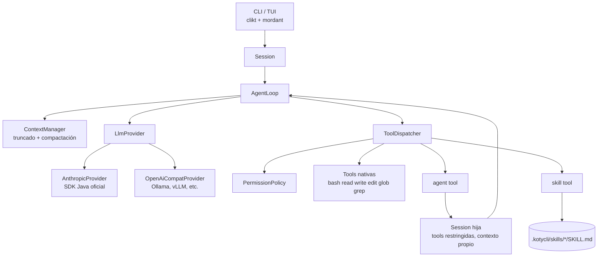

# Arquitectura de kotycli

kotycli es un harness de agente de código para terminal, escrito en Kotlin sobre la JVM y distribuido como un único fat jar. El objetivo es no depender de ningún proveedor de modelos ni de ningún sistema operativo: el loop, las tools, los skills y los subagentes son nuestros, y el modelo es un adaptador intercambiable.

## Documentos

| Doc | Qué cubre |
|-----|-----------|
| [01-vision-y-principios](01-vision-y-principios.md) | Objetivos, no-objetivos y principios de diseño |
| [02-agent-loop](02-agent-loop.md) | El loop: máquina de estados, turnos, dispatch de tools, gestión de contexto, cancelación |
| [03-tools](03-tools.md) | Contrato de tool, tools nativas (bash, read, write, edit, glob, grep), permisos |
| [04-subagentes](04-subagentes.md) | Subagentes como sesiones aisladas en el mismo proceso |
| [05-skills](05-skills.md) | Skills como carpetas con `SKILL.md`, carga progresiva |
| [06-proveedores](06-proveedores.md) | Modelo de mensajes neutral y adaptadores de proveedor |
| [07-build-y-distribucion](07-build-y-distribucion.md) | Gradle, shadow jar, dependencias, layout de paquetes, roadmap |

Las decisiones cerradas están en [`docs/adr/`](../adr/). Si un doc de arquitectura y un ADR se contradicen, manda el ADR más reciente.

## Mapa de alto nivel

## Vocabulario

- **Session**: historial de mensajes + configuración (system prompt, tools, proveedor, política de permisos, presupuesto). Una por conversación, y una nueva por cada subagente.
- **Turn**: lo que pasa desde que entra un mensaje de usuario hasta que el modelo termina sin pedir tools. Un turn contiene N llamadas al modelo.
- **Tool call**: bloque `tool_use` que emite el modelo. El harness lo ejecuta y devuelve un `tool_result`.
- **Provider**: adaptador que traduce nuestro modelo neutral de mensajes al API de un proveedor concreto y viceversa.
- **Skill**: carpeta con un `SKILL.md` con instrucciones que el modelo carga bajo demanda.
- **Subagente**: sesión hija con su propio contexto y un subconjunto de tools, que devuelve un único texto final al padre.
