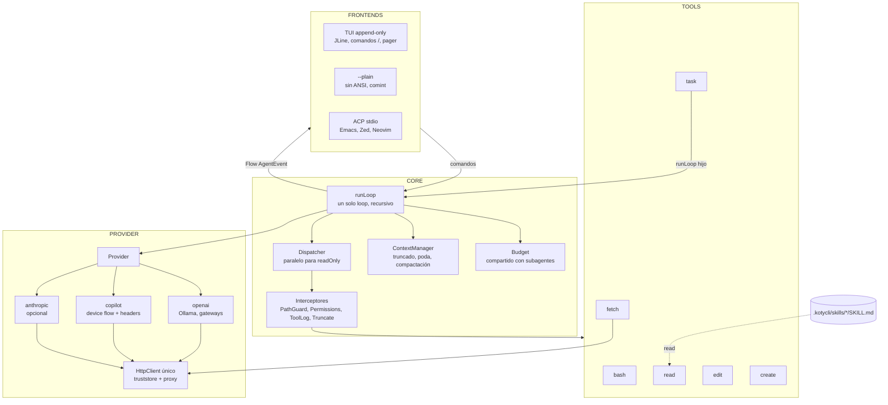

# Arquitectura de kotycli

kotycli es un agente de código de terminal, propio y mínimo: seis tools, un loop, subagentes y varios frontends sobre el mismo core. Escrito en Kotlin sobre la JVM y distribuido como un único fat jar, Windows-first, para que el proxy corporativo, el truststore y el render en consola dejen de ser el problema de otro. El modelo es un adaptador intercambiable: Copilot en el trabajo, Ollama en casa, cualquier endpoint OpenAI-compatible como plan B.

## Documentos

| Doc | Qué cubre |
|-----|-----------|
| [01-vision-y-principios](01-vision-y-principios.md) | Por qué existe, "poseer la capa que falla", no-objetivos, principios |
| [02-agent-loop](02-agent-loop.md) | `runLoop`, modelo de mensajes, dispatcher e interceptores, contexto, cancelación, eventos, presupuestos |
| [03-tools](03-tools.md) | Contrato, schema desde `@Serializable`, las seis tools, permisos |
| [04-subagentes](04-subagentes.md) | La tool `task`: roles, contexto virgen, presupuesto compartido, profundidad 2 |
| [05-skills](05-skills.md) | Skills en formato abierto, carga bajo demanda con `read`, `KOTYCLI.md` |
| [06-proveedores](06-proveedores.md) | Interfaz `Provider`, adaptadores `openai`, `copilot` y `anthropic`, configuración |
| [07-build-y-distribucion](07-build-y-distribucion.md) | Gradle, shadow jar, dependencias, layout de paquetes, roadmap v1 a v3 |
| [08-frontends](08-frontends.md) | TUI append-only, `--plain`, ACP para Emacs/Zed/Neovim, comandos `/`, pager |
| [09-red-corporativa](09-red-corporativa.md) | El único `HttpClient`, truststore, proxy, `doctor`, detalles Windows |

Las decisiones cerradas están en [`docs/adr/`](../adr/). Si un doc de arquitectura y un ADR se contradicen, manda el ADR más reciente.

## Capas

Cuatro capas con una regla estricta: el core no sabe si lo pinta una TUI o Emacs, y no sabe si el modelo es Copilot o un Ollama local. Toda la comunicación hacia arriba es un `Flow<AgentEvent>`; toda la comunicación hacia abajo es la interfaz `Provider`.

La frontera que paga dividendos: TUI, ACP y `--plain` son tres `main` distintos consumiendo el mismo core. Añadir un frontend nunca toca el loop.

## Vocabulario

- **AgentContext**: historial de mensajes + configuración (system prompt, tools, proveedor, interceptores, presupuesto, profundidad). Uno por conversación, y uno nuevo por cada subagente.
- **Turn**: desde que entra un mensaje de usuario hasta que el modelo termina sin pedir tools. Un turn contiene N llamadas al modelo.
- **Tool call**: bloque `tool_use` que emite el modelo. El dispatcher lo pasa por los interceptores, lo ejecuta y devuelve un `tool_result`.
- **Interceptor**: punto de corte before/after en el dispatcher. Permisos, logging, guardas de path y truncado son interceptores.
- **Provider**: adaptador que traduce nuestro modelo neutral de mensajes al wire de un proveedor y viceversa.
- **Skill**: carpeta con un `SKILL.md` que el modelo lee bajo demanda.
- **Subagente**: `runLoop` hijo con contexto virgen y un toolset por rol, que devuelve un único texto final al padre y descuenta tokens del mismo presupuesto.
